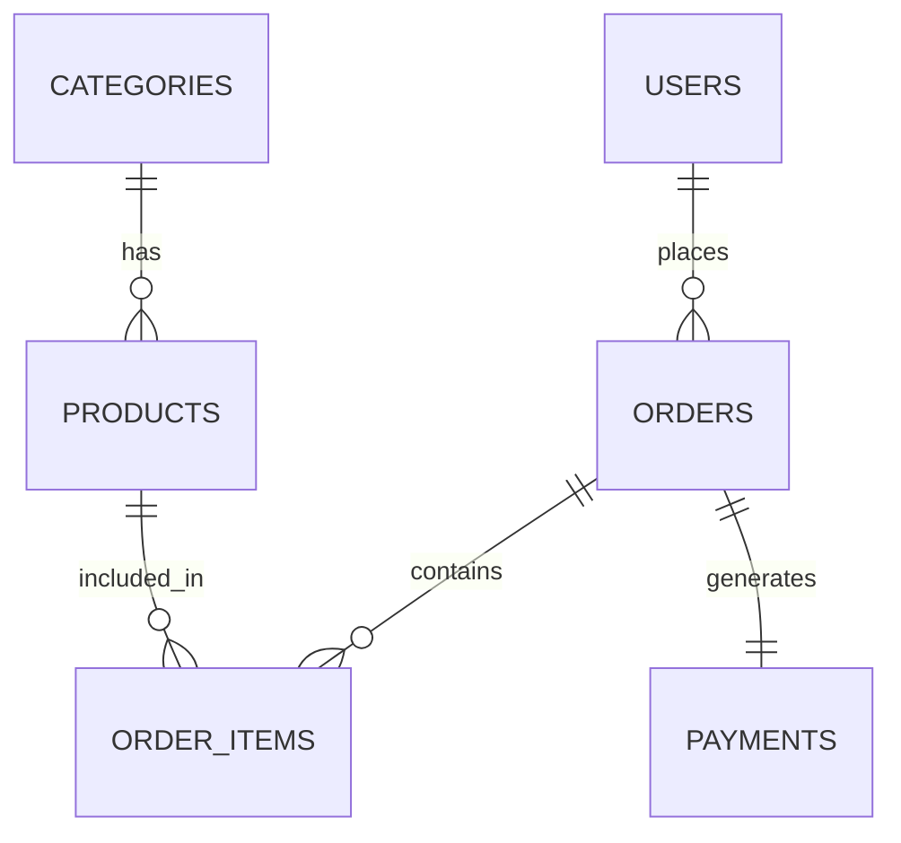
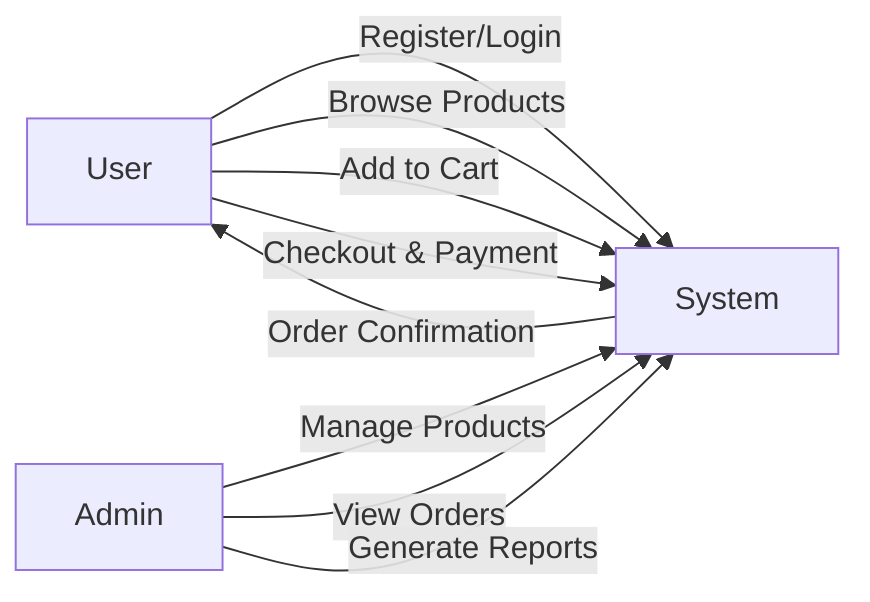

# GiftShop – PHP Major Project

A **full‑stack e‑commerce web application** built using **PHP, MySQL, Bootstrap, HTML, and CSS**.  
This project is designed as a **Major Project** for academic submission, showcasing real‑world concepts such as authentication, role‑based access (Admin/User), relational database design with foreign keys, order management, reporting, and a demo payment workflow.

---

## 1. Project Overview

**GiftShop** is an online gift‑selling platform where users can:
- Browse products by categories
- Register and log in securely
- Add products to cart and place orders
- Complete a **demo payment**
- View their order history

An **Admin Panel** allows administrators to:
- Manage categories and products
- View and update orders
- Track payments
- Generate basic sales reports

The project follows a **modular PHP structure** (similar to component‑based systems), with reusable files for navbar, footer, and configuration to keep the codebase clean and professional.

---

## 2. How to Run This Project on Your Local Machine

### Prerequisites
- XAMPP / WAMP / MAMP (PHP 8.x recommended)
- Web Browser (Chrome / Edge / Firefox)

### Steps

1. **Copy Project Folder**
   - Place the project folder inside:
     ```
     xampp/htdocs/
     ```

2. **Start Server**
   - Open XAMPP Control Panel
   - Start **Apache** and **MySQL**

3. **Create Database**
   - Open browser and go to:
     ```
     http://localhost/phpmyadmin
     ```
   - Create a database named:
     ```
     giftshop
     ```

4. **Import Database**
   - Import the SQL files provided in the project:
     - `schema.sql`
     - `seed.sql`

5. **Run the Project**
   - User Side:
     ```
     http://localhost/giftshop_php/
     ```
   - Admin Panel:
     ```
     http://localhost/giftshop_php/admin/
     ```

### Default Admin Credentials
```
Email: admin@demo.com
Password: Admin@123
```

---

## 3. Technologies Used

### Frontend
- HTML5
- CSS3
- Bootstrap 5 (Responsive UI)
- JavaScript (basic interactions)

### Backend
- PHP (Procedural, modular structure)
- MySQL (Relational Database)

### Server
- Apache (via XAMPP)

### Tools
- phpMyAdmin
- VS Code

---

## 4. Features of the Project

### User Features
- User Registration & Login
- Category‑wise product browsing
- Product details page
- Add to Cart
- Checkout (Login required)
- Demo Payment System
- Order history & order details
- Fully responsive UI

### Admin Features
- Secure Admin Login
- Dashboard with statistics
- Category Management (Add / Activate / Deactivate)
- Product Management
- Order Management (Status update)
- Payment tracking
- Sales Reports (date‑wise)

### System Features
- Session‑based authentication
- Foreign key relationships
- Clean folder structure
- Reusable components (navbar, footer)
- Professional project layout

---

## 5. Database Design (ERD)



---

## 6. Data Flow Diagram (DFD – Level 1)



---

## 7. Project Folder Structure (Simplified)

```
giftshop_php/
│
├── admin/
│   ├── login.php
│   ├── index.php
│   ├── products.php
│   ├── categories.php
│   ├── orders.php
│   └── reports.php
│
├── config/
│   └── config.php
│
├── includes/
│   ├── navbar.php
│   └── footer.php
│
├── sql/
│   ├── schema.sql
│   └── seed.sql
│
├── index.php
├── login.php
├── register.php
├── cart.php
├── checkout.php
└── payment.php
```

---

## 8. Payment Note

- The payment system is **Demo / Simulation Based**
- Used only for **project demonstration**
- Can be extended later with **Razorpay / Stripe (Test Mode)**

---

## 9. Academic Note

This project is suitable for:
- **MCA / BCA Major Project**
- Viva & practical demonstration
- Database + Web Technology evaluation

---

## 10. Author

**Developed for Academic Purpose**  
Project Type: **PHP + MySQL Major Project**
